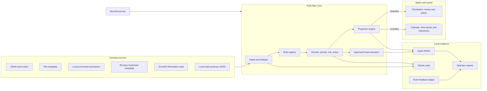
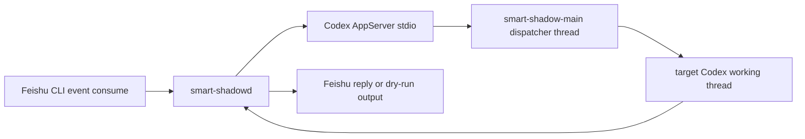

# Smart Shadow

Smart Shadow is a Swift-native macOS assistant core. It ingests local signals, applies an auditable rule registry, prepares review work, and projects important items into Apple Reminders and Apple Calendar through EventKit.

The project is intentionally local-first: runtime state, audit logs, reports, and personal source data stay under ignored local paths. The public repository contains the core, rules, examples, and documentation.

## Architecture



## Quick Start

Requirements:

- macOS 14 or newer
- Swift 6 toolchain
- EventKit permissions for real Calendar or Reminders writes

```sh
cp config/smart-shadow.example.json config/smart-shadow.json
swift build
bin/smart-shadow init
bin/smart-shadow validate-rules
bin/smart-shadow sample-event
bin/smart-shadow run-once --dry-run --no-reminders
bin/smart-shadow health
```

The dry run does not write to Apple Reminders or Apple Calendar. For real EventKit writes, request permission in the foreground first:

```sh
bin/smart-shadow eventkit-request-access all
```

## Current Verified Slice

- SwiftPM executable: `smart-shadow-mac-core`
- Optional SwiftUI menu-bar executable: `smart-shadow-menu`
- User-level launchd service support
- JSON event inbox processing
- Source acceptance previews before enabling daemon sensing
- Rule registry validation and rule feedback ledger
- SQLite state, audit JSONL, and reports under ignored `var/`
- Apple Reminders review-card creation through EventKit
- Calendar/Reminders projection mapping to avoid unrelated duplicates
- Source diagnostics through `source-doctor`, including Mail.app-backed intake before enabling daemon sensing
- LaunchAgent/runtime diagnostics through `service-status`

## Common Commands

```sh
bin/smart-shadow sources
bin/smart-shadow source-doctor
bin/smart-shadow accept-source file_metadata
bin/smart-shadow accept-source chrome_bookmarks
bin/smart-shadow accept-source apple_reminders_inbox
bin/smart-shadow accept-source apple_mail_summary
bin/smart-shadow accept-source apple_mail_app
bin/smart-shadow enable-source chrome_bookmarks
bin/smart-shadow disable-source chrome_bookmarks
bin/smart-shadow run-once
bin/smart-shadow run-once --dry-run --no-reminders
bin/smart-shadow service-status
bin/smart-shadow report
bin/smart-shadow rule-feedback
bin/smart-shadow install-launchd
bin/smart-shadow start
bin/smart-shadow stop
script/build_and_run.sh --verify
```

`enable-source` requires a latest `ok` acceptance report unless `--force` is used. EventKit-backed Reminders sensing also requires official Reminders authorization. `apple_mail_app` uses a configured Mail.app reader for real mail intake; acceptance previews decisions without mutating Mail.app, while non-dry-run processing may call configured executors such as low-value archive.

## Menu Bar Status Panel

`smart-shadow-menu` is a SwiftUI menu-bar control panel for the local daemon. It does not replace the `me.longbiaochen.smart-shadow` LaunchAgent and does not write directly to Calendar, Reminders, source configs, or app databases. The panel reads `service-status` and `health`, then offers only safe controls: refresh, start, stop, report, open project, and open logs.

Run it with:

```sh
./script/build_and_run.sh
```

The script builds `smart-shadow-menu`, stages `dist/SmartShadowMenu.app`, and launches it as an `LSUIElement` menu-bar app without a Dock icon.

## smart-shadowd Feishu Bridge MVP

`smart-shadowd` is an optional thin TypeScript bridge for Feishu-to-Codex task routing. It does not replace the Swift-native macOS core and it does not project mail-derived work into shared Feishu task boards. Its job is limited to:



Install Node dependencies:

```sh
pnpm install
```

Feishu CLI prerequisites:

- `lark-cli` is installed and authenticated.
- The bot or user identity can consume `im.message.receive_v1`.
- For first local runs, keep `feishu.dryRunReply: true` in [config/smart-shadow.yaml](config/smart-shadow.yaml).

Codex AppServer prerequisites:

- `codex app-server --stdio` is available on `PATH`.
- The bridge initializes it with `experimentalApi: true`.
- The current AppServer method shapes should be verified against the local Codex version; a formal implementation should regenerate types from the Codex app-server schema instead of relying on the MVP wrapper.

Configuration lives in [config/smart-shadow.yaml](config/smart-shadow.yaml). Override the path with:

```sh
SMART_SHADOW_CONFIG=/absolute/path/to/smart-shadow.yaml pnpm dev:shadowd
```

The registry defaults to `.smart-shadow/registry.json` and is created automatically. It stores the dispatcher thread id, known projects, Feishu-to-Codex thread bindings, and processed message ids.

Run development mode with one event and a timeout:

```sh
pnpm dev:shadowd -- --max-events=1 --timeout=30s
```

Dry-run replies print the exact outgoing message instead of sending it:

```sh
[dry-run feishu reply] chat=oc_xxx thread=omt_xxx message=om_xxx
...
```

Test dispatcher and local bridge logic:

```sh
pnpm demo:shadowd
pnpm test:shadowd
pnpm typecheck:shadowd
```

Test Feishu event consume directly before full-loop testing:

```sh
lark-cli event consume im.message.receive_v1 --as bot
```

Full dry-run loop:

1. Set `feishu.dryRunReply: true`.
2. Run `pnpm dev:shadowd -- --max-events=1 --timeout=30s`.
3. Send `Smart Shadow 测试：请回复你收到了。`.
4. Confirm logs show normalization, dispatcher decision, and dry-run reply output.

Current limitations:

- Live Feishu sending is wrapped behind `FeishuReplier`, but the exact `lark-cli im send` command still needs confirmation with this Mac's current `lark-cli im --help`.
- No SQLite, launchd installer, web UI, approval broker, multi-user administration, or complex stream reducer is included in this MVP.
- Server-initiated AppServer requests are recognized and declined so they do not crash the bridge.
- `turn/completed` notification shapes may drift with Codex versions; verify against local AppServer events before running unattended.

Roadmap:

- Generate AppServer TypeScript types from the installed Codex version.
- Add a fixture-driven AppServer simulator for end-to-end tests.
- Confirm and harden the live Feishu reply command.
- Add a launchd template only after the dry-run loop is proven stable.
- Promote useful dispatcher examples into [.agents/skills/smart-shadow/SKILL.md](.agents/skills/smart-shadow/SKILL.md).

## Documentation

- [Architecture](docs/ARCHITECTURE.md)
- [Operations](docs/OPERATIONS.md)
- [Security](docs/SECURITY.md)
- [Roadmap](docs/ROADMAP.md)
- [Agent implementation rules](AGENTS.md)

## Verification

```sh
swift build --scratch-path "$PWD/.build" --cache-path "$PWD/.build/swiftpm-cache" --manifest-cache local
bin/smart-shadow-test
bin/smart-shadow --config config/smart-shadow.example.json validate-rules
```

The regression suite covers source enablement gates, EventKit authorization gates, source readiness diagnostics, and service status reporting.
