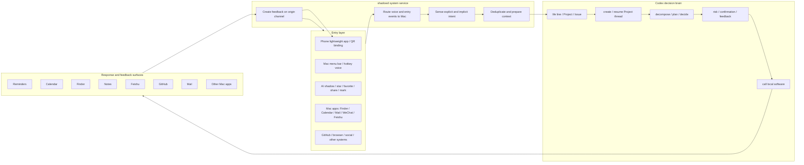
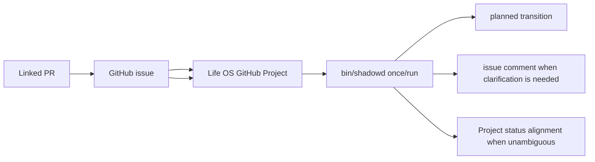
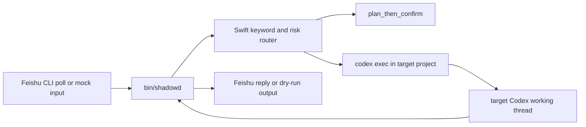

# Smart Shadow

Smart Shadow is an iPhone-first, Mac-service-backed personal shadow system backed by Codex and a local `shadowd` service on the user's Mac. It has an entry layer across phone and computer surfaces: in-app AI shadow controls, star/favorite/share/mark operations, the Mac menu-bar app, global hotkey voice, and a phone lightweight app that can be invoked after QR-code binding. Voice interactions eventually route back to `shadowd` on the Mac. `shadowd` is the always-on sensing and feedback bridge; Codex is the decision brain that creates or resumes the right Project thread, uses local software to move the work forward, and keeps life lines, Projects, and Issues coherent.

The product is not a chat app, a replacement for GitHub, a full project-management suite, or a proactive social agent. It keeps the user in charge of Mail, messaging, news, feeds, files, calendar, and external content, then shortens the path from "I expressed or revealed this intent" to "Codex is working in the corresponding Project thread, local software is being used, and `shadowd` has reported back to the channel where the task was posted."

At the implementation level, Smart Shadow is Codex productization plus a Swift-native Mac system service: Agent rules, memory, skills, scripts, automation boundaries, and `shadowd` make Codex fit the user's personal operating style while using the software already on the computer.

The four life lines are a design philosophy, not a mandate that every life area must live inside one app. The current defaults are practical: work-related Projects and Issues are tracked on Feishu task boards through Feishu CLI; personal and life-related responses are tracked on the corresponding Apple Reminders boards or lists. GitHub remains the code/PR/Issue/CI and repo-centered execution surface, while Calendar carries time blocks and Finder/Notes/Contacts/Photos/Music carry supporting assets.

The current repository also contains the local Swift-native Mac capabilities that make the loop auditable: `shadowd`, CLI controls, launchd lifecycle support, GitHub issue handling, EventKit projections, local logs, and explicit-intent source/rule diagnostics. Runtime state, audit logs, reports, and personal source data stay under ignored local paths. The public repository contains the app, daemon, rules, examples, and documentation.

The source PRD is saved in [docs/PRD.md](docs/PRD.md). The current processing
model is documented in [docs/SPACE_TIME_MATRIX.md](docs/SPACE_TIME_MATRIX.md).
The local Codex carrier assembly is documented in
[docs/CODEX_CARRIER.md](docs/CODEX_CARRIER.md).

## Architecture



## Quick Start

Requirements:

- macOS 14 or newer
- Swift 6 toolchain
- EventKit permissions for real Calendar or Reminders writes
- Contacts permission only when a confirmed task needs Google Contacts projection
- Google OAuth login only when a confirmed task needs Google Calendar, Tasks, or Contacts context/projection

```sh
cp config/smart-shadow.example.json config/smart-shadow.json
swift build
bin/smart-shadow init
bin/smart-shadow validate-rules
bin/smart-shadow sample-event
bin/smart-shadow run-once --dry-run --no-reminders
bin/smart-shadow health
```

The dry run does not write to Apple Reminders or Apple Calendar. For real EventKit writes, request permission in the foreground first:

```sh
bin/smart-shadow eventkit-request-access all
```

## Current Verified Slice

- Entry-layer surfaces: `SmartShadowIOS` for QR-bound mobile voice/text entry and `smart-shadow-menu` for Mac menu-bar entry.
- SwiftPM executable: `shadowd`
- Optional SwiftUI menu-bar executable: `smart-shadow-menu`
- User-level launchd service support
- JSON event inbox processing
- Explicit intent source acceptance previews before enabling source adapters
- Rule registry validation and rule feedback ledger
- SQLite state, audit JSONL, and reports under ignored `var/`
- Codex as the decision brain for life lines, Projects, Issues, priority,
  execution planning, Project-thread creation/resume, review, local software use,
  and target-surface choice
- `shadowd` as the local system service for entry routing, sensing, Codex
  connection, tracking, audit, and origin-channel feedback
- Reminders as a response/reminder surface
- Calendar as a time-block, deadline, review, rhythm, and milestone surface
- Calendar/Reminders projection mapping to avoid unrelated duplicates
- Source diagnostics through `source-doctor`; Mail.app is treated as an issue-oriented external flow surface only for user-marked mail, shared/forwarded mail, confirmed mail decisions, or local debug inputs submitted back as explicit Project/Issue decisions
- Structured Lark calendar and task adapters through local `lark-cli`, with EventKit projection into Calendar and Reminders when tied to explicit tasks
- Explicit `project-mail-decision` projection for Codex Automation mail decisions, limited to Apple Reminders/Calendar, record-only, and low-risk Mail responses
- One-way Google Calendar/Tasks/Contacts sync into local Apple iCloud-backed Calendar, Reminders, and Contacts without macOS Internet Accounts
- LaunchAgent/runtime diagnostics through `service-status`

## Common Commands

```sh
bin/smart-shadow sources
bin/smart-shadow source-doctor
bin/smart-shadow accept-source file_metadata
bin/smart-shadow accept-source lark_calendar_events
bin/smart-shadow accept-source lark_tasks
bin/smart-shadow accept-source chrome_bookmarks
bin/smart-shadow accept-source apple_reminders_inbox
bin/smart-shadow accept-source apple_mail_summary
bin/smart-shadow project-mail-decision --input tests/fixtures/mail-decision-work.json --dry-run
bin/smart-shadow enable-source chrome_bookmarks
bin/smart-shadow disable-source chrome_bookmarks
bin/smart-shadow run-once
bin/smart-shadow run-once --dry-run --no-reminders
bin/smart-shadow reminders-plan-quadrants --dry-run
bin/smart-shadow reminders-db-doctor
bin/smart-shadow service-status
bin/smart-shadow report
bin/smart-shadow rule-feedback
bin/smart-shadow install-launchd
bin/smart-shadow start
bin/smart-shadow stop
script/build_and_run.sh --verify
```

`accept-source` is now Explicit Intent Source Acceptance: it previews a source adapter without writing SQLite state, creating reminders/calendar events, sending messages, or mutating external apps. `enable-source` requires a latest `ok` acceptance report unless `--force` is used. All source adapters are disabled by default. EventKit-backed Reminders adapters also require official Reminders authorization. Mail.app is not a broad daemon source: Codex Automation or the user marks, shares, forwards, or judges mail, then Smart Shadow treats the selected message/thread as an external Issue candidate that can be mapped to a Project and projected through `project-mail-decision`.

`lark_calendar_events`, `lark_tasks`, Google sources, Calendar, Tasks, and Contacts are context/projection adapters for explicit tasks. They must not proactively decide what matters, start social interactions, or create external commitments. Mail decisions never create Lark tasks by default; confirmed work mail can become a Project Issue, remain linked to its original Mail thread, and project to the Apple Reminders `WORK` list or Apple Calendar when the payload contains a real response or scheduled time block.

## Explicit Intent Inputs

Smart Shadow accepts follow-up work only from explicit user operations:

- Voice task creation.
- Important-mail marking or a confirmed `project-mail-decision` payload.
- Article save, bookmark creation, saved link, or share-sheet submission to Smart Shadow.
- A direct operation on a specific item, such as "follow up on this".
- GitHub issue/comment content that explicitly mentions `@shadow`.
- A system-generated suggestion after the user confirms it.

Every follow-up input should carry `origin.user_action`, `source`, `captured_at`, `payload`, `requires_confirmation`, `user_approved`, and `follow_up_task_id` when available. Inputs without a clear `origin.user_action` or `user_approved=true` may be recorded or previewed for debugging, but they cannot trigger follow-up responses such as review reminders, archive/delete/reply/forward operations, or social outreach.

## macOS Companion Voice Entry

`smart-shadow-companion-mac` is a temporary SwiftUI menu-bar voice entry for
Smart Shadow development and local testing. The PRD product entry is the iPhone
app; the macOS companion only exercises the same voice-task intake contract while
the iOS flow is being hardened.

The companion is not the product surface and it is not the execution engine. It
may record short-lived local audio while the user is speaking, but the canonical
contract is local voice processing first: reuse or abstract ChatType runtime
capabilities for transcription and polish, show the final text to the user, then
create or update a GitHub issue/comment with the user's own GitHub identity.
Raw audio must not be uploaded to GitHub, handed to `shadowd`, or sent through a
cloud relay.

Run it with:

```sh
./script/build_and_run.sh
```

The script builds `smart-shadow-companion-mac`, stages
`dist/SmartShadowCompanion.app`, and launches it as an `LSUIElement` menu-bar
app without a Dock icon. Set `SMART_SHADOW_GITHUB_CLIENT_ID` before launching if
the OAuth client id is not already saved in app settings.

## Menu Bar Status Panel

`smart-shadow-menu` is a SwiftUI menu-bar control panel for the local daemon. It does not replace the `me.longbiaochen.smart-shadow` LaunchAgent and does not write directly to Calendar, Reminders, source configs, or app databases. The panel reads `service-status` and `health`, then offers only safe controls: refresh, start, stop, report, open project, and open logs.

Run it with:

```sh
swift run smart-shadow-menu
```

The companion run script is now the default local app launcher; use SwiftPM
directly for the older status panel while it remains in the package.

## shadowd GitHub Task Loop

`shadowd` is the Swift-native local service behind Smart Shadow's repo-centered
execution loop. It runs on the SOL MacBook, uses GitHub Issue / Project / PR
state as an external development and collaboration record, assigns work to local
Codex agents, and writes progress back as Issue comments when a Project / Issue
has a GitHub projection. It does not maintain a separate authoritative task
database. Local files are limited to logs, dry-run reports, audit JSONL, caches,
and other non-authoritative runtime evidence.

Terminology:

- `smart-shadow`: iPhone app, Codex project, and skill name.
- `shadow`: unified external agent identity.
- `shadowd`: Swift-native local service on SOL.
- `life-os`: GitHub repo and GitHub Project dashboard used by the current MVP loop.
- `ChatType Runtime/Polish`: local ASR and text polish capability used before GitHub submission.

The current implementation can inspect the whole Life OS Project without
requiring the `smartshadow` label. The PRD target is broader: voice input becomes
a structured task, the app asks for confirmation, GitHub Issue / Comment / PR
becomes the traceable record, and the app shows task status from Draft through
Done or Failed.



Run a dry-run pass:

```sh
bin/shadowd once --dry-run
```

Expected behavior:

- `shadowd once` reads open issues from the Life OS GitHub Project.
- Smart Shadow-created issues/comments contain final user-confirmed text, not audio packets or raw transcript dumps.
- `shadowd` never runs ASR/transcription and never reads raw audio from GitHub.
- If an issue's custom status is `完成` while Project Status is not done, `shadowd` plans a Project Status alignment.
- If an ordinary issue is missing the required task template, `shadowd` plans a clarification comment instead of starting work.
- Re-running `shadowd once` does not duplicate comments for no-op issues.
- GitHub writes are gated; comments require explicit `--write-comments`.

The operator wrapper is [bin/shadowd](bin/shadowd), with:

```sh
bin/shadowd once --dry-run
bin/shadowd run
bin/shadowd inspect-issue --issue <number>
```

Install the current GitHub polling daemon as a user-level launchd service:

```sh
bin/shadowd install
bin/shadowd status
bin/shadowd logs
```

The LaunchAgent label is `me.longbiaochen.shadowd`. It runs [bin/shadowd](bin/shadowd) with the `run` command and writes logs to `var/logs/shadowd.out.log` and `var/logs/shadowd.err.log`.

State behavior is documented in [docs/state-machine.md](docs/state-machine.md). GitHub token scopes are documented in [docs/github-permissions.md](docs/github-permissions.md).

## GitHub Issue Workflow

`smart-shadow` can accept GitHub issues as local Codex tasks through `shadowd`. The external GitHub agent identity is `shadow`: assign an issue to `shadow`, or comment `@shadow` to trigger the workflow.

The Swift `shadowd` implementation normalizes the issue into an internal task, creates a `shadow/issue-<number>-<slug>` branch in the configured local repository, runs `codex exec`, runs the configured tests, creates a PR titled `[shadow] <issue title>`, and comments progress back to the issue.

See [docs/github-issue-workflow.md](docs/github-issue-workflow.md) for webhook events, repo mapping, environment variables, safety limits, and local test commands. The project name remains `smart-shadow`; the GitHub agent is `shadow`; the local daemon is `shadowd`.

## Feishu Bridge

Feishu/Lark routing is part of the Swift-native `shadowd` command surface. The old local experiment has been folded into `bin/shadowd` and [Sources/SmartShadowMacCore](Sources/SmartShadowMacCore/main.swift); there is no supported Python daemon path.

The bridge does not replace the GitHub issue workflow and it does not project mail-derived work into shared Feishu task boards. Its job is limited to:



Configure the bridge in [config/smart-shadow.example.json](config/smart-shadow.example.json) under `feishu_bridge`. The default routing behavior is intentionally conservative:

- Messages matching configured project keywords can run through `codex exec`.
- The default route is `plan_then_confirm`.
- High-risk keywords such as production, deletion, database, payment, token, cookie, contract, and investment force confirmation before execution.
- Session bindings and Codex logs are written under ignored `var/` paths.

Feishu CLI prerequisites:

- `lark-cli` is installed and authenticated.
- The bot identity can read messages in the configured chat for `feishu-once`.
- For first local runs, keep `feishu_bridge.feishu.dry_run_reply: true`.

Probe local CLI capability:

```sh
bin/shadowd feishu-probe
```

Run the old mock-loop behavior through Swift:

```sh
bin/shadowd feishu-mock --message "devops 只回复一句 shadowd Swift bridge 收到，不修改文件"
```

Poll one configured chat message and reply through `lark-cli`, or dry-run the reply when configured:

```sh
bin/shadowd feishu-once
```

The GitHub automation path remains separate:

```sh
bin/shadowd once --dry-run
bin/shadowd github-issue --payload payload.json --event issues --dry-run
```

TypeScript code under [src](src) is retained only for historical/reference tests while the Swift daemon absorbs useful behavior. Do not use it as the production bridge, and do not add new Python daemon code.

Test Feishu CLI access directly before live chat testing:

```sh
lark-cli event consume im.message.receive_v1 --as bot
```

Current limitations:

- `feishu-once` polls a configured chat; it is not a second long-running daemon story.
- The supported long-running daemon is still `bin/shadowd run` for the GitHub Project reconciler.
- Codex execution uses the local `codex exec` CLI path, matching the GitHub issue workflow.

## Documentation

- [Architecture](docs/ARCHITECTURE.md)
- [Operations](docs/OPERATIONS.md)
- [Security](docs/SECURITY.md)
- [Roadmap](docs/ROADMAP.md)
- [Workflow](docs/WORKFLOW.md)
- [Agent implementation rules](AGENTS.md)

## Verification

```sh
swift build --scratch-path "$PWD/.build" --cache-path "$PWD/.build/swiftpm-cache" --manifest-cache local
bin/smart-shadow-test
bin/smart-shadow --config config/smart-shadow.example.json validate-rules
```

The regression suite covers source enablement gates, EventKit authorization gates, source readiness diagnostics, and service status reporting.
