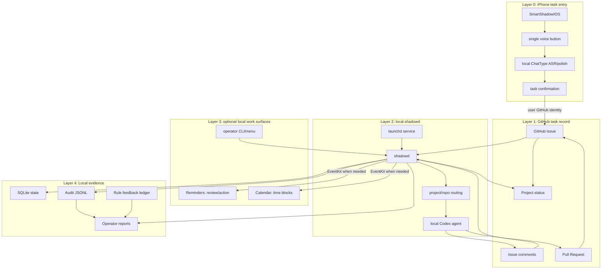
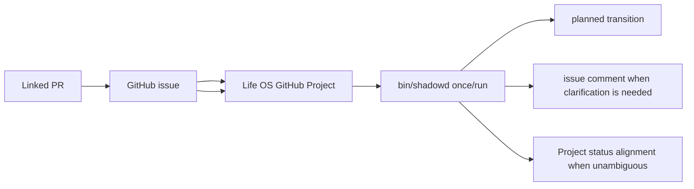
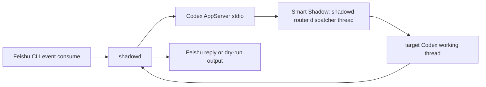

# Smart Shadow

Smart Shadow is an iPhone-first personal task entry app backed by a local `shadowd` execution loop. The core experience is a single voice button: the user speaks a task, the app transcribes and polishes it locally, the user confirms the final text, and the unified agent identity `shadow` drives the work through GitHub Issue / PR / Comment records.

The product is not a chat app, a replacement for GitHub, or a full project-management suite. It shortens the path from "I thought of a task" to "an agent has started, is reporting progress, and can be reviewed."

The current repository also contains the local Swift-native Mac capabilities that make the loop auditable: `shadowd`, CLI controls, launchd lifecycle support, GitHub issue handling, EventKit projections, local logs, and source/rule diagnostics. Runtime state, audit logs, reports, and personal source data stay under ignored local paths. The public repository contains the app, daemon, rules, examples, and documentation.

The source PRD is saved in [docs/PRD.md](docs/PRD.md).

## Architecture



## Quick Start

Requirements:

- macOS 14 or newer
- Swift 6 toolchain
- EventKit permissions for real Calendar or Reminders writes
- Contacts permission for Google Contacts sync
- Google OAuth login for Google Calendar, Tasks, and Contacts sources

```sh
cp config/smart-shadow.example.json config/smart-shadow.json
swift build
bin/smart-shadow init
bin/smart-shadow validate-rules
bin/smart-shadow sample-event
bin/smart-shadow run-once --dry-run --no-reminders
bin/smart-shadow health
```

The dry run does not write to Apple Reminders or Apple Calendar. For real EventKit writes, request permission in the foreground first:

```sh
bin/smart-shadow eventkit-request-access all
```

## Current Verified Slice

- iOS app target `SmartShadowIOS` for voice-first task entry and GitHub-backed delivery work.
- SwiftPM executable: `shadowd`
- Optional SwiftUI menu-bar executable: `smart-shadow-menu`
- User-level launchd service support
- JSON event inbox processing
- Source acceptance previews before enabling daemon sensing
- Rule registry validation and rule feedback ledger
- SQLite state, audit JSONL, and reports under ignored `var/`
- Apple Reminders review-card creation through EventKit
- Calendar/Reminders projection mapping to avoid unrelated duplicates
- Source diagnostics through `source-doctor`; Mail.app handling is performed by Codex Automation and submitted back as explicit projection decisions
- Structured Lark calendar and task sensing through local `lark-cli`, with EventKit projection into Calendar and Reminders
- Explicit `project-mail-decision` projection for Codex Automation mail decisions, limited to Apple Reminders/Calendar, record-only, and low-risk Mail actions
- One-way Google Calendar/Tasks/Contacts sync into local Apple iCloud-backed Calendar, Reminders, and Contacts without macOS Internet Accounts
- LaunchAgent/runtime diagnostics through `service-status`

## Common Commands

```sh
bin/smart-shadow sources
bin/smart-shadow source-doctor
bin/smart-shadow accept-source file_metadata
bin/smart-shadow accept-source lark_calendar_events
bin/smart-shadow accept-source lark_tasks
bin/smart-shadow accept-source chrome_bookmarks
bin/smart-shadow accept-source apple_reminders_inbox
bin/smart-shadow accept-source apple_mail_summary
bin/smart-shadow project-mail-decision --input tests/fixtures/mail-decision-work.json --dry-run
bin/smart-shadow enable-source chrome_bookmarks
bin/smart-shadow disable-source chrome_bookmarks
bin/smart-shadow run-once
bin/smart-shadow run-once --dry-run --no-reminders
bin/smart-shadow reminders-plan-quadrants --dry-run
bin/smart-shadow reminders-db-doctor
bin/smart-shadow service-status
bin/smart-shadow report
bin/smart-shadow rule-feedback
bin/smart-shadow install-launchd
bin/smart-shadow start
bin/smart-shadow stop
script/build_and_run.sh --verify
```

`enable-source` requires a latest `ok` acceptance report unless `--force` is used. EventKit-backed Reminders sensing also requires official Reminders authorization. Mail.app is no longer a daemon source: Codex Automation reads and judges mail, then calls `project-mail-decision` with a structured decision for Smart Shadow to project.

`lark_calendar_events` and `lark_tasks` use the local `lark-cli` in user identity mode. These sensing sources are read-only on the Lark side: calendar events are projected to Apple Calendar, while tasks are projected to Apple Reminders only. Mail decisions never create Lark tasks; work mail is projected to the Apple Reminders `WORK` list and any scheduled time block goes to Apple Calendar through EventKit.

## macOS Companion Voice Entry

`smart-shadow-companion-mac` is a temporary SwiftUI menu-bar voice entry for
Smart Shadow development and local testing. The PRD product entry is the iPhone
app; the macOS companion only exercises the same voice-task intake contract while
the iOS flow is being hardened.

The companion is not the product surface and it is not the execution engine. It
may record short-lived local audio while the user is speaking, but the canonical
contract is local voice processing first: reuse or abstract ChatType runtime
capabilities for transcription and polish, show the final text to the user, then
create or update a GitHub issue/comment with the user's own GitHub identity.
Raw audio must not be uploaded to GitHub, handed to `shadowd`, or sent through a
cloud relay.

Run it with:

```sh
./script/build_and_run.sh
```

The script builds `smart-shadow-companion-mac`, stages
`dist/SmartShadowCompanion.app`, and launches it as an `LSUIElement` menu-bar
app without a Dock icon. Set `SMART_SHADOW_GITHUB_CLIENT_ID` before launching if
the OAuth client id is not already saved in app settings.

## Menu Bar Status Panel

`smart-shadow-menu` is a SwiftUI menu-bar control panel for the local daemon. It does not replace the `me.longbiaochen.smart-shadow` LaunchAgent and does not write directly to Calendar, Reminders, source configs, or app databases. The panel reads `service-status` and `health`, then offers only safe controls: refresh, start, stop, report, open project, and open logs.

Run it with:

```sh
swift run smart-shadow-menu
```

The companion run script is now the default local app launcher; use SwiftPM
directly for the older status panel while it remains in the package.

## shadowd GitHub Task Loop

`shadowd` is the Swift-native local service behind the Smart Shadow MVP. It runs
on the SOL MacBook, treats GitHub Issue / Project / PR state as the durable
source of truth, assigns work to local Codex agents, and writes progress back as
Issue comments. It does not maintain a separate authoritative task database.
Local files are limited to logs, dry-run reports, audit JSONL, caches, and other
non-authoritative runtime evidence.

Terminology:

- `smart-shadow`: iPhone app, Codex project, and skill name.
- `shadow`: unified external agent identity.
- `shadowd`: Swift-native local service on SOL.
- `life-os`: GitHub repo and GitHub Project dashboard used by the current MVP loop.
- `ChatType Runtime/Polish`: local ASR and text polish capability used before GitHub submission.

The current implementation can inspect the whole Life OS Project without
requiring the `smartshadow` label. The PRD target is broader: voice input becomes
a structured task, the app asks for confirmation, GitHub Issue / Comment / PR
becomes the traceable record, and the app shows task status from Draft through
Done or Failed.



Run a dry-run pass:

```sh
bin/shadowd once --dry-run
```

Expected behavior:

- `shadowd once` reads open issues from the Life OS GitHub Project.
- Smart Shadow-created issues/comments contain final user-confirmed text, not audio packets or raw transcript dumps.
- `shadowd` never runs ASR/transcription and never reads raw audio from GitHub.
- If an issue's custom status is `完成` while Project Status is not done, `shadowd` plans a Project Status alignment.
- If an ordinary issue is missing the required task template, `shadowd` plans a clarification comment instead of starting work.
- Re-running `shadowd once` does not duplicate comments for no-op issues.
- GitHub writes are gated; comments require explicit `--write-comments`.

The operator wrapper is [bin/shadowd](bin/shadowd), with:

```sh
bin/shadowd once --dry-run
bin/shadowd run
bin/shadowd inspect-issue --issue <number>
```

Install the current GitHub polling daemon as a user-level launchd service:

```sh
bin/shadowd install
bin/shadowd status
bin/shadowd logs
```

The LaunchAgent label is `me.longbiaochen.shadowd`. It runs [bin/shadowd](bin/shadowd) with the `run` command and writes logs to `var/logs/shadowd.out.log` and `var/logs/shadowd.err.log`.

State behavior is documented in [docs/state-machine.md](docs/state-machine.md). GitHub token scopes are documented in [docs/github-permissions.md](docs/github-permissions.md).

## GitHub Issue Workflow

`smart-shadow` can accept GitHub issues as local Codex tasks through `shadowd`. The external GitHub agent identity is `shadow`: assign an issue to `shadow`, or comment `@shadow` to trigger the workflow.

The Swift `shadowd` implementation normalizes the issue into an internal task, creates a `shadow/issue-<number>-<slug>` branch in the configured local repository, runs `codex exec`, runs the configured tests, creates a PR titled `[shadow] <issue title>`, and comments progress back to the issue.

See [docs/github-issue-workflow.md](docs/github-issue-workflow.md) for webhook events, repo mapping, environment variables, safety limits, and local test commands. The project name remains `smart-shadow`; the GitHub agent is `shadow`; the local daemon is `shadowd`.

## Legacy Feishu Bridge

The older TypeScript Feishu-to-Codex bridge remains in the repository as a transition path, but `bin/shadowd` no longer starts it and it no longer owns GitHub issue execution. `shadowd run` and `shadowd github-issue` are Swift-native paths.

The legacy bridge does not replace the Swift-native macOS core and it does not project mail-derived work into shared Feishu task boards. Its job is limited to:



Install Node dependencies:

```sh
pnpm install
```

Feishu CLI prerequisites:

- `lark-cli` is installed and authenticated.
- The bot or user identity can consume `im.message.receive_v1`.
- For first local runs, keep `feishu.dryRunReply: true` in [config/smart-shadow.yaml](config/smart-shadow.yaml).

Codex AppServer prerequisites:

- `codex app-server --stdio` is available on `PATH`.
- The bridge initializes it with `experimentalApi: true`.
- The current AppServer method shapes should be verified against the local Codex version; a formal implementation should regenerate types from the Codex app-server schema instead of relying on the MVP wrapper.

Configuration lives in [config/smart-shadow.yaml](config/smart-shadow.yaml). Override the path with:

```sh
SMART_SHADOW_CONFIG=/absolute/path/to/smart-shadow.yaml pnpm dev:shadowd
```

The registry defaults to `.smart-shadow/registry.json` and is created automatically. It stores the Smart Shadow dispatcher thread id, known projects, Feishu-to-Codex thread bindings, and processed message ids.

Feishu-originated main sessions are created in the Smart Shadow project by default. The dispatcher prompt intentionally does not include the full project or session inventory. Routing uses the compact Feishu message plus any existing binding, while project/session inventory is resolved through Codex/AppServer or daemon-side validation before execution.

Workflow-rule refinement, Smart Shadow / SmartShader skill publishing, nightly maintenance, approval boundaries, and closed-loop testing policy are specified in [docs/WORKFLOW.md](docs/WORKFLOW.md).

Run development mode with one event and a timeout:

```sh
pnpm dev:shadowd -- --max-events=1 --timeout=30s
```

Use the TypeScript development commands directly for foreground legacy bridge testing.

Dry-run replies print the exact outgoing message instead of sending it:

```sh
[dry-run feishu reply] chat=oc_xxx thread=omt_xxx message=om_xxx
...
```

Test dispatcher and local bridge logic:

```sh
pnpm demo:shadowd
pnpm test:shadowd
pnpm typecheck:shadowd
```

Test Feishu event consume directly before full-loop testing:

```sh
lark-cli event consume im.message.receive_v1 --as bot
```

Full dry-run loop:

1. Set `feishu.dryRunReply: true`.
2. Run `pnpm dev:shadowd -- --max-events=1 --timeout=30s`.
3. Send `Smart Shadow 测试：请回复你收到了。`.
4. Confirm logs show normalization, dispatcher decision, and dry-run reply output.

Current limitations:

- Live Feishu sending is wrapped behind `FeishuReplier`, but the exact `lark-cli im send` command still needs confirmation with this Mac's current `lark-cli im --help`.
- No SQLite, launchd installer, web UI, approval broker, multi-user administration, or complex stream reducer is included in this MVP.
- Server-initiated AppServer requests are recognized and declined so they do not crash the bridge.
- `turn/completed` notification shapes may drift with Codex versions; verify against local AppServer events before running unattended.

Roadmap:

- Generate AppServer TypeScript types from the installed Codex version.
- Add a fixture-driven AppServer simulator for end-to-end tests.
- Confirm and harden the live Feishu reply command.
- Add the nightly skill-maintenance launchd timer only after the dry-run extraction, verification, approval, GitHub push, and X-post draft workflow is proven stable.
- Promote useful dispatcher examples into [.agents/skills/smart-shadow/SKILL.md](.agents/skills/smart-shadow/SKILL.md).

## Documentation

- [Architecture](docs/ARCHITECTURE.md)
- [Operations](docs/OPERATIONS.md)
- [Security](docs/SECURITY.md)
- [Roadmap](docs/ROADMAP.md)
- [Workflow](docs/WORKFLOW.md)
- [Agent implementation rules](AGENTS.md)

## Verification

```sh
swift build --scratch-path "$PWD/.build" --cache-path "$PWD/.build/swiftpm-cache" --manifest-cache local
bin/smart-shadow-test
bin/smart-shadow --config config/smart-shadow.example.json validate-rules
```

The regression suite covers source enablement gates, EventKit authorization gates, source readiness diagnostics, and service status reporting.
