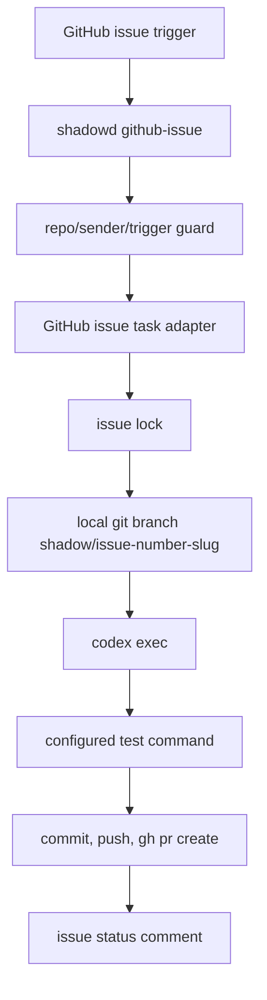

# GitHub Issue Workflow

In the Smart Shadow MVP, GitHub is the durable task record. The iPhone app turns
confirmed user intent into a tracked task, `shadowd` receives and routes the
task, Codex creates or resumes the corresponding Project thread and uses local
software or Codex agents to move the work forward, Issue comments carry
origin-channel feedback, and Pull Requests carry reviewable code changes.

GitHub Issues are therefore not just an input channel for local Codex execution;
they are the traceable work ledger that lets the app show task state and lets the
user review outcomes.

Naming is fixed:

- Project: `smart-shadow`
- GitHub agent: `shadow`
- Local daemon: `shadowd`
- GitHub assignee: `shadow` by default
- Comment mention: `@shadow`
- Branch prefix: `shadow/`

If the real GitHub bot account is not `shadow`, configure `github.assignee` with the real account, for example `shadow-bot`. Comments, branch names, PR titles, and external agent identity still use `shadow`.

## Triggers

`shadowd` accepts an issue when one of these GitHub events arrives:

1. `issues.assigned` where `assignee.login == github.assignee`
2. `issue_comment.created` where the comment starts with `@shadow`

Supported first-version commands are:

```text
@shadow
@shadow fix
@shadow continue
@shadow test
@shadow explain
```

`@shadow`, `@shadow fix`, and `@shadow continue` currently use the same execution path. `@shadow explain` is parsed and allowed, but should stay conservative until an explanation-only path is added.

The iPhone app path creates or updates Issues after user confirmation. App-side
Draft tasks should not create GitHub records until the user confirms submission.

## Configuration

The production path is the Swift `shadowd` executable. Configuration for this path lives in [config/smart-shadow.example.json](../config/smart-shadow.example.json) or the JSON file selected by `SMART_SHADOW_CONFIG`. The GitHub section must include an explicit repo mapping:

```json
{
  "github": {
    "enabled": true,
    "agentName": "shadow",
    "daemonName": "shadowd",
    "assignee": "shadow",
    "allowedCommentCommands": ["@shadow", "@shadow fix", "@shadow continue", "@shadow test", "@shadow explain"],
    "events": ["issues", "issue_comment"],
    "repos": {
      "OWNER/REPO": {
        "localPath": "/path/to/local/repo",
        "defaultBase": "main",
        "allowedSenders": ["longbiaochen"],
        "testCommand": "bin/smart-shadow-test",
        "codexSandbox": "workspace-write"
      }
    }
  }
}
```

`allowedSenders` is enforced before any local Git or Codex work starts. `testCommand` is trusted local configuration only; issue content is never used to build the test command.

## Runtime Flow

The issue payload is normalized into a small internal task shape before it reaches the execution workflow. Raw GitHub payloads stay at the adapter boundary.



Branch names use:

```text
shadow/issue-<issue_number>-<slug>
```

PR titles use:

```text
[shadow] <issue title>
```

PR bodies state that `shadow` generated the PR locally through `shadowd` inside `smart-shadow`, and that a human must review before merge.

## Issue Body Contract

A Smart Shadow-created Issue should include:

- task title
- background
- target output
- acceptance criteria
- related project or repo
- source: Smart Shadow
- executor: `shadow`
- current status label or Project status

Development tasks default to Issue creation. Product, planning, and
documentation tasks may also use Issues when they need progress tracking,
review, or follow-up.

## App Status Mapping

The app-facing state maps onto GitHub issue, label, comment, and PR state:

| App state | GitHub-backed meaning |
|---|---|
| Draft | Local app task, not submitted |
| Submitted | Issue created or updated by Smart Shadow |
| Queued | `shadowd` accepted the Issue and is waiting to run |
| Running | Agent started and wrote a running comment |
| Need Input | Issue is blocked on user input |
| PR Ready | Linked PR exists and is ready for review |
| Done | Work completed and summarized |
| Failed | Execution failed and failure summary was written |
| Cancelled | User cancelled or issue was closed as cancelled |

## Status Comments

Issue comments use the external agent name `shadow`, not `smart-shadow`.

`shadowd` writes:

- queued acknowledgement
- running status with branch name
- created PR URL and summary
- no-code-changes status
- failure summary with a pointer to local `shadowd` logs

Full command output stays in local logs under [var/logs/github-issue-workflow](../var/logs/github-issue-workflow). Issue comments and PR bodies only include summaries.

Comments are written only for meaningful lifecycle events: queued, running,
current understanding, blocker, user follow-up, PR ready, completion, and
failure. They should not become high-frequency logs.

## Safety

The GitHub issue workflow enforces these boundaries:

- Webhook signature verification belongs at the HTTP ingress before calling `shadowd github-issue`.
- Only configured repositories are accepted.
- Only configured senders are accepted.
- No automatic merge is performed.
- Default Codex sandbox is `workspace-write`.
- Issue title, body, and comments are treated as untrusted prompt input.
- Commands are executed through argv arrays, not shell interpolation.
- Each issue uses an independent `shadow/` branch.
- A per-issue lock prevents duplicate concurrent execution.
- Secrets are not written into issue comments, PR bodies, or prompts.

## Local Test

Run the non-network test suite:

```bash
pnpm typecheck:shadowd
pnpm test:shadowd
```

Run the Swift GitHub issue workflow in dry-run mode with a captured payload:

```bash
SMART_SHADOW_CONFIG=/path/to/smart-shadow.json bin/shadowd github-issue --dry-run --event issues --payload /path/to/payload.json
```

The Swift-native operator wrapper is:

```bash
bin/shadowd status
bin/shadowd once --dry-run
bin/shadowd run
bin/shadowd github-issue --dry-run --event issue_comment --payload /path/to/payload.json
```

`smart-shadow` is the project name, `shadow` is the GitHub agent identity, and `shadowd` is the local service name.
